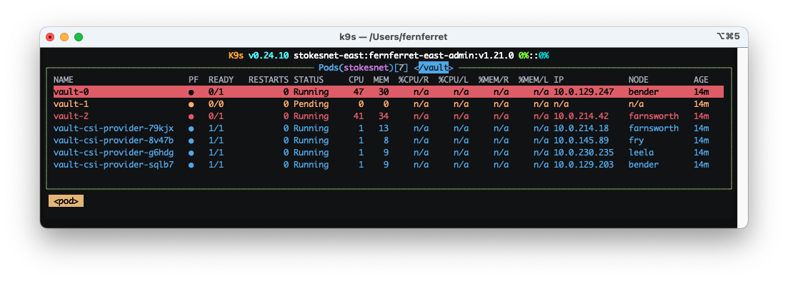
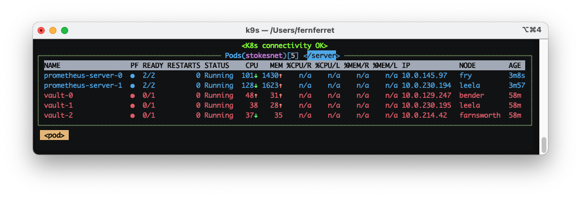

When I was installing the vault helm chart, something interesting happened, I
wasn't able to place the pods on my nodes:



As you can see in the screenshot, only 2 of my pods placed, yet I'd labeled the
nodes correctly:

```text
$ k get nodes -L stokesnet/vault -l stokesnet/vault=enabled
NAME         STATUS   ROLES    AGE    VERSION   VAULT
bender       Ready    worker   189d   v1.21.0   enabled
farnsworth   Ready    worker   483d   v1.21.0   enabled
leela        Ready    worker   485d   v1.21.1   enabled
```

**So why wasn't leela getting a pod?**

I also verified there were no taints preventing scheduling of these pods, after
diving through these I looked at selectors:

```text
$ k get statefulset -n stokesnet vault -o yaml
...
    spec:
      affinity:
        podAntiAffinity:
          requiredDuringSchedulingIgnoredDuringExecution:
          - labelSelector:
              matchLabels:
                app.kubernetes.io/instance: vault
                app.kubernetes.io/name: vault
                component: server
            topologyKey: kubernetes.io/hostname
...
```

I think what's going on is the matchLabels are somehow being treated
individually and I have something else with a `component` of `server`. This
still didn't make a ton of sense to me at this point but I decided to see what
else was using the `component: server` label.

A quick grep shows there's at least one more:

```text
$ k get sts -n stokesnet -o yaml | grep "^        component: server"
        component: server
        component: server
```

I started looking for pods with this label, and that led me to `prometheus`:

```text
$ k get pod -n stokesnet -l component=server
NAME                  READY   STATUS    RESTARTS   AGE
prometheus-server-0   2/2     Running   0          2d12h
prometheus-server-1   2/2     Running   0          2d12h
vault-0               0/1     Running   0          20m
vault-1               0/1     Pending   0          20m
vault-2               0/1     Running   0          20m
```

Let's see what the anti-affinity is on the `prometheus-server`:

```text
$ kubectl get sts -n stokesnet prometheus-server -o yaml
...
      spec:
        affinity:
          podAntiAffinity:
            requiredDuringSchedulingIgnoredDuringExecution:
            - labelSelector:
                matchExpressions:
                - key: component
                  operator: In
                  values:
                  - server
              topologyKey: kubernetes.io/hostname
...
```

Well that's not good! This is telling us to keep **any** pod with the label
`component: server` off of this node! So it's not allowing vault to place. Since
I'm installing vault and prometheus in the same namespace (`stokesnet`) this is
a conflict. If they'd been in different namespaces things would be fine.

Looking at my [promethus values
file](https://gitlab.com/stokesnet/kube/-/blob/7a52a435d1af22ff30f2ef9bdb6b6fe3338761ee/stokesnet/prom-server.yaml),
sure enough I'd done a poor job with the affinity:

```yaml
  affinity:
    podAntiAffinity:
      requiredDuringSchedulingIgnoredDuringExecution:
        - labelSelector:
            matchExpressions:
            - key: component
              operator: In
              values:
              - server
          topologyKey: "kubernetes.io/hostname"
```

Once I changed the affinity to:

```yaml
  affinity:
    podAntiAffinity:
      requiredDuringSchedulingIgnoredDuringExecution:
        - labelSelector:
            matchLabels:
              component: server
              app: prometheus
              release: prometheus
          topologyKey: "kubernetes.io/hostname"
```

The vault pods were able to schedule. One other trick (shown here) is to filter
in k9s with `/server` This was a very quick way of discovering which pods were
involved in the scheduling conflict.


