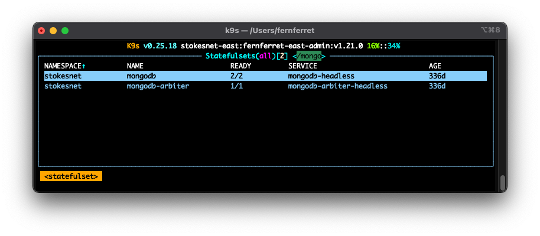
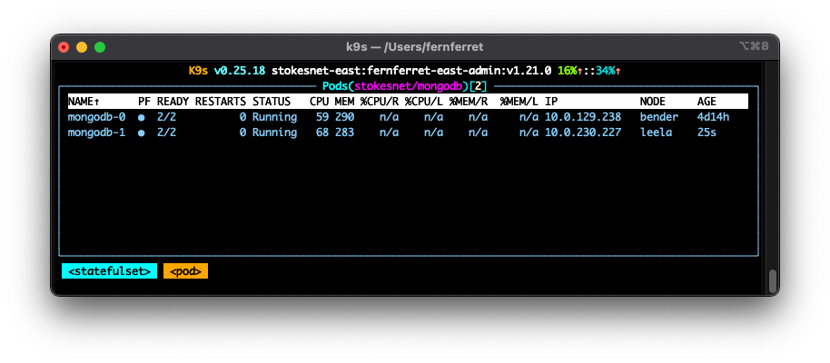
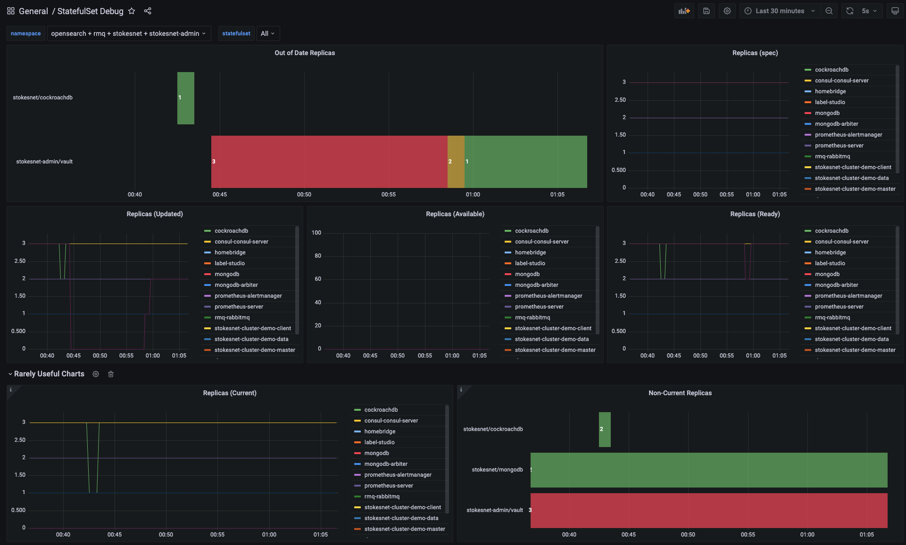
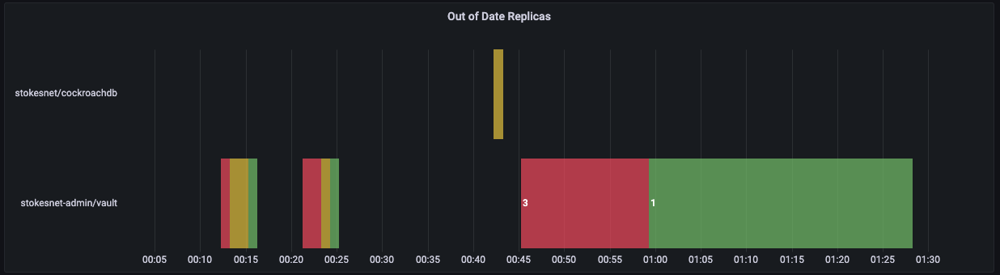
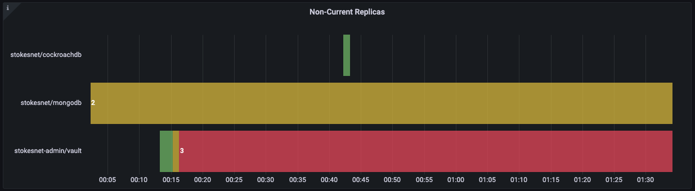

I was updating my kubernetes cluster the other week and noticed that there was a
chart update for my MongoDB install. I'm not sure what prompted me to look, but
I noticed that before the update, I was running 2 different minor versions of
MongoDB in my replica set (4.4.8 vs 4.4.10).

This had me a bit concerned until I realized that I'd setup the StatefulSet to
have an `updateStrategy` of **OnDelete** like so:

```yaml
apiVersion: apps/v1
kind: StatefulSet
metadata:
  name: mongodb
spec:
  ...
  updateStrategy:
    type: OnDelete
  ...
```

I knew from reading the docs on the [OnDelete
`updateStrategy`](https://kubernetes.io/docs/concepts/workloads/controllers/statefulset/#update-strategies)
that this meant the StatefulSet controller would not automatically update my
MongoDB software; instead I was responsible for deleting each pod in the set to
allow me to check each one out before moving on to the next.

This is exactly what I wanted for a database like MongoDB, but how did I forget
to update all of them?! This is what had me worried, so to avoid doing this
again (and to verify my cluster was fully updated) I decided to have a look at
my process and figure out how I missed this.

## How did this happen


Well... clearly my trusty sidekick k9s is to blame right? Everything looked
great in k9s:



Even the pods look great



So from a quick glance it's easy to miss a pod since there's no obvious
indicator that there's a problem... and I think this is intentional.

There might not be a problem, but things certainly are't all at the same state,
and not knowing that **is a problem**.

## Let's plot some things

Since I was unable to see the missing update in k9s (obviously) I decided to
have a look in my Prometheus metrics.

I made a small grafana page to analyze my StatefulSets. Here's a capture of it
when I was performing arbitrary restarts on a few StatefulSets. I focused on 2
key metrics to understand how they worked:

* Updated Replicas (`kube_statefulset_status_replicas_updated`)
* Current Replicas (`kube_statefulset_status_replicas_current`)

You can [download a copy of the dashboard here](files/dashboard.json).



I wanted to show anything here that might indicate there being a problem and how
long it was a problem so I focused on 2 plots named "Out of Date Replicas" and
"Non-Current Replicas". The other plots exist only to show other conditions
(like scaling a StatefulSet) would potentially trigger false positives in a
potential alert rule.

## Out of Date (Updated) Replicas



To generate this plot I used the following query:

```promql
avg(
  kube_statefulset_replicas{statefulset=~"$statefulset"} - 
  kube_statefulset_status_replicas_updated{statefulset=~"$statefulset"}
) by (exported_namespace, statefulset) > 0
```

I opted to title this plot **Out of Date Replicas**. The goal is to show
StatefulSets that not have been fully updated by looking at the delta in
replicas vs "Updated Replicas".

This matched my expectations looking at the manifests exactly! So... what about
Current Replicas? I wanted to plot that too to make sure I didn't miss
something.

## Current Replicas



To generate this plot I used the following query:

```promql
avg(
  kube_statefulset_status_replicas{statefulset=~"$statefulset"} - 
  kube_statefulset_status_replicas_current{statefulset=~"$statefulset"}
) by (exported_namespace, statefulset) > 0
```

This plot was very interesting and honestly triggered the rest of my deep-dive.

If we look at the `cockroachdb` StatefulSet, it looks nearly the same (although
there is a quantity difference), but look at `vault`!

I'd just re-installed vault in my test cluster and had restarted it around 00:15
(the restart can be seen in the above "out of date" plot!) but once it was
considered "non-current" it stayed that way forever.

This brings me to MongoDB. Nothing happened to mongo and it was correctly
updated through all of these captures.

My hyphotheisis was that StatefulSets using **OnDelete** as an `updateStrategy`
would never update the `currentRevision` hash, so after the first update/restart
they'd always be out of date. That's certainly what the plots looked like.

## Drawing conclusions

After inspecting these 2 metrics, I had my answer: `updateRevision` translates
to "number of outdated pods". It shows the total number of non-current pods in a
StatefulSet.

I could have stopped there but then that would have left me wondering: what does
`currentRevsion` do?

I dove into [the `stateful_set_control.go`
code](https://github.com/kubernetes/kubernetes/blob/master/pkg/controller/statefulset/stateful_set_control.go)
and ran a few test to confirm.

### How StatefulSets (normally) work

Kubernetes uses 2 variables to control rolling updates of StatefulSets:

* `currentRevision` is a hash of the latest complete update (all replicas were
  updated)
* `updateRevision` is a hash of the desired update

Each pod has a label that contains the revision hash it was generated from
called the `controller-revision-hash`. Since pods are immutable, this hash will
never change so Kubernetes can identify pods that are out of date easily.

Given the previous information, we can state:

* `updatedReplicas`: The number of replicas that match the latest StatefulSet
  revision.
* `currentReplicas`: The number of replicas that match the latest fully complete
  StatefulSet update

What this means is that `currentReplicas` only applies to StatefulSets not using
an **OnDelete** `updateStrategy`.

### A brief look at RollingUpdate

Reading the source is all well and good but I wanted to make sure things worked
how I thought they should, so I grabbed a StatefulSet using **OnUpdate** and did
a few restarts.

Let's look at my CockroachDB instance. It's steady state right now, all pods are
good to go and they're all updated to the correct revision. We'll also note that
the `currentRevision` and `updateRevision` **are identical right now**.

```text
$ kubectl get pods -n stokesnet -l app.kubernetes.io/name=cockroachdb -L controller-revision-hash
NAME                     READY   STATUS      RESTARTS   AGE     CONTROLLER-REVISION-HASH
cockroachdb-0            1/1     Running     0          56s     cockroachdb-7d6b9f6cdd
cockroachdb-1            1/1     Running     0          89s     cockroachdb-7d6b9f6cdd
cockroachdb-2            1/1     Running     0          111s    cockroachdb-7d6b9f6cdd
cockroachdb-3            1/1     Running     0          2m10s   cockroachdb-7d6b9f6cdd

$ kubectl get statefulset cockroachdb -o yaml | yq e .status -
collisionCount: 0
currentReplicas: 4
currentRevision: cockroachdb-7d6b9f6cdd
observedGeneration: 11
readyReplicas: 4
replicas: 4
updateRevision: cockroachdb-7d6b9f6cdd
updatedReplicas: 4
```

Let's issue an update (via `kubectl rollout restart`). We can see
`cockroachdb-3` get recreated and get a new controller-revision-hash (that
matches the `updateRevision`). The status updates to show `currentReplicas=3`
and `updatedReplicas=1`. So what the `currentReplicas` metric is really telling
us is (almost) how many "non-updated" replicas there are. In the next step we'll
see why this isn't exactly true.

```text
$ kubectl get pods -n stokesnet -l app.kubernetes.io/name=cockroachdb -L controller-revision-hash
NAME                     READY   STATUS      RESTARTS   AGE     CONTROLLER-REVISION-HASH
cockroachdb-0            1/1     Running     0          2m3s    cockroachdb-7d6b9f6cdd
cockroachdb-1            1/1     Running     0          2m36s   cockroachdb-7d6b9f6cdd
cockroachdb-2            1/1     Running     0          2m58s   cockroachdb-7d6b9f6cdd
cockroachdb-3            0/1     Running     0          7s      cockroachdb-75d7c744c8

$ kubectl get statefulset cockroachdb -o yaml | yq e .status -
collisionCount: 0
currentReplicas: 3
currentRevision: cockroachdb-7d6b9f6cdd
observedGeneration: 12
readyReplicas: 3
replicas: 4
updateRevision: cockroachdb-75d7c744c8
updatedReplicas: 1
```

A little time goes by and the StatefulSet controller has updated 3 of our pods.
At this point we'll issue another restart (before the StatefulSet has fully
updated).

```text
$ kubectl get pods -n stokesnet -l app.kubernetes.io/name=cockroachdb -L controller-revision-hash
NAME                     READY   STATUS      RESTARTS   AGE     CONTROLLER-REVISION-HASH
cockroachdb-0            1/1     Running     0          3m21s   cockroachdb-7d6b9f6cdd
cockroachdb-1            0/1     Running     0          4s      cockroachdb-75d7c744c8
cockroachdb-2            1/1     Running     0          48s     cockroachdb-75d7c744c8
cockroachdb-3            1/1     Running     0          85s     cockroachdb-75d7c744c8

$ kubectl get statefulset cockroachdb -o yaml | yq e .status -
collisionCount: 0
currentReplicas: 1
currentRevision: cockroachdb-7d6b9f6cdd
observedGeneration: 12
readyReplicas: 3
replicas: 4
updateRevision: cockroachdb-75d7c744c8
updatedReplicas: 3

$ kubectl rollout restart statefulset/cockroachdb
```

Running our status commands again, we can finally see something a bit unique:

* `currentReplicas=1` (cockroachdb-0)
* `readyReplicas=1` (cockroachdb-0, cockroachdb-2)
* `updatedReplicas=1` (cockroachdb-3)

```text
kubectl get pods -n stokesnet -l app.kubernetes.io/name=cockroachdb -L controller-revision-hash
NAME                     READY   STATUS      RESTARTS   AGE     CONTROLLER-REVISION-HASH
cockroachdb-0            1/1     Running     0          3m40s   cockroachdb-7d6b9f6cdd
cockroachdb-1            0/1     Running     0          23s     cockroachdb-75d7c744c8
cockroachdb-2            1/1     Running     0          67s     cockroachdb-75d7c744c8
cockroachdb-3            0/1     Running     0          4s      cockroachdb-66f7ccb4f8

kubectl get statefulset cockroachdb -o yaml | yq e .status -
collisionCount: 0
currentReplicas: 1
currentRevision: cockroachdb-7d6b9f6cdd
observedGeneration: 13
readyReplicas: 2
replicas: 4
updateRevision: cockroachdb-66f7ccb4f8
updatedReplicas: 1
```

This finally gives us the confirmation I was looking for:

* `currentReplicas`  is the number of replicas that match that **last** fully
  updated statefulset (this is not particularly useful for me)
* `updatedReplicas`  is the number of replicas that match the **latest**
  revision of the statefulset (this is not particularly useful for me)

Every restart/change to the statefulset, Kubernetes will generate a new
`updateRevision` and wait for the StatefulSet controller to bring all pods to
that revision. the `currentRevision` as shown by the code is just a way to track
where we started.

## Wrap it up

I feel like there's a lot more to **every** aspect of Kubernetes than meets the
eye. Things like this update quirk are interesting because what "unhealthy"
means is different to different teams.

Is out-of-date unhealthy? Well, it depends. To me, it's a casual problem, one
that needs to be looked at, but nothing's on fire so I guess it's time to grab a
coffee.
