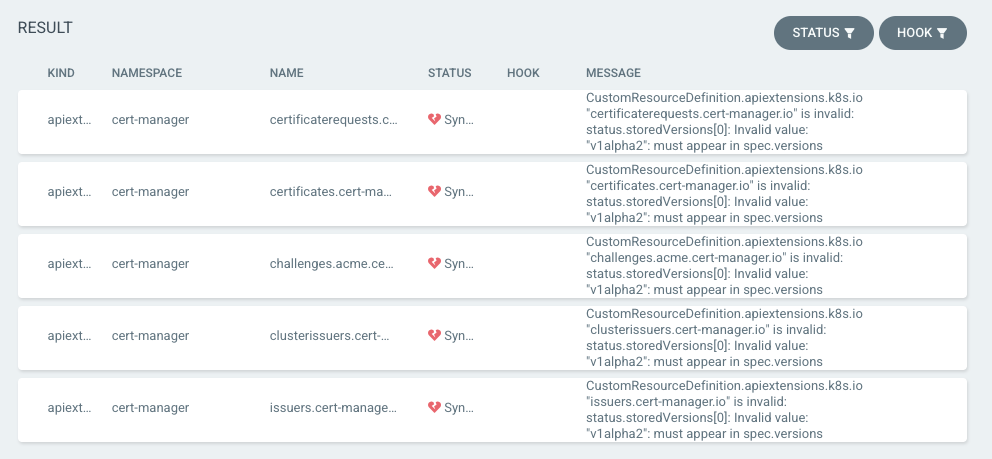

Today, I was performing a routine update in my Kubernetes cluster and I
encountered a unique error in ArgoCD. I thought the update to [Cert
Manager](https://cert-manager.io/docs/), from `1.6.1` to `1.7.1` would be a
simple one due to SemVer, but a CRD issue stopped me from upgrading.

That issue, while easily fixable if I'd just read the release notes, led me to
an interesting journey about CRD deprecations.
<!--more-->

## The Error

When I tried to sync, ArgoCD spat out a scary looking error message about all
the CRDs:



I'd missed the note on the [ArtifactHub
page](https://artifacthub.io/packages/helm/cert-manager/cert-manager#upgrading-the-chart)
stating that I should check the release notes for [Cert
Manager](https://github.com/cert-manager/cert-manager/releases/tag/v1.7.0).
Turns out, they'd removed a bunch of old CRD versions in `1.7.0`. That's cool,
they also mention using their tool `cmctl` to easily do this.

While I could just grab their `cmctl` and run it blindly, I thought it'd be fun
to investigate this issue from a pure Kubernetes perspective. What if I needed
to do this with one of my own CRDs or someone else had a CRD that we needed
deprecate and they didn't provide a `THINGctl`?

I started looking for documents related to `status.storedVersions` since that's
what my error was and found there's a section specifically on this topic named
[upgrading existing object to a new stored
version](https://kubernetes.io/docs/tasks/extend-kubernetes/custom-resources/custom-resource-definition-versioning/#upgrade-existing-objects-to-a-new-stored-version).

## What is `storedVersions`

The API documents states that `storedVersions`:

> The API server records each version which has ever been marked as the storage
> version in the status field storedVersions. Objects may have been persisted at
> any version that has ever been designated as a storage version. No objects can
> exist in storage at a version that has never been a storage version.

Let's have a look at `status.storedVersions` in my `ClusterIssuers` CRD, since I
know I have one and at one point it was `v1alpha2`.

```text
kubectl get crd clusterissuers.cert-manager.io -o yaml | \
  yq e '.status.storedVersions' -
- v1alpha2
- v1
```

This means that at some point I've had a `v1alpha2` and a `v1` version of this
CRD installed. This does not mean that I've had instances of each of these, just
that the CRD definition existed at each of these API versions. For my cluster
this means I was not very good at updating Cert Manager 😞.

The process is effectively:

* verify that we don't have any more of the old APIs
  * this verification should happen in my repo of manifests as k8s will
    translate versions as I pull them out
* patch the status to remove the clusters' memory of them
* upgrade the CRD spec to a version that removes the deprecated versions

## Fixing our CRD

The reason this is "broken" is that the new version no longer has `v1alpha2` in
it, so Kubernetes is trying to protect us by saying "hey man, at some point you
had `v1alpha2` in your cluster, but you're trying to remove it from the CRD!
This might mean some of your stuff won't work!" Thanks [Captain
Kube](https://www.cncf.io/phippy/)!

We can use the `patch` operation combined with `kube proxy` [as stated in the
docs](https://kubernetes.io/docs/tasks/extend-kubernetes/custom-resources/custom-resource-definition-versioning/#upgrade-existing-objects-to-a-new-stored-version)
to remove the `v1alpha2` CRD `storedVersion`:

```text
kubectl proxy &
curl --header "Content-Type: application/json-patch+json" \
  --request PATCH http://localhost:8001/apis/apiextensions.k8s.io/v1/customresourcedefinitions/clusterissuers.cert-manager.io/status \
  --data '[{"op": "replace", "path": "/status/storedVersions", "value":["v1"]}]'
```

This will return the CRD and you should be able to verify it no longer has the
old `storedVersion`:

```text
kubectl get crd clusterissuers.cert-manager.io -o yaml | \
  yq e '.status.storedVersions' -
- v1
```

Awesome, we're ready to rock now and can go sync ArgoCD!